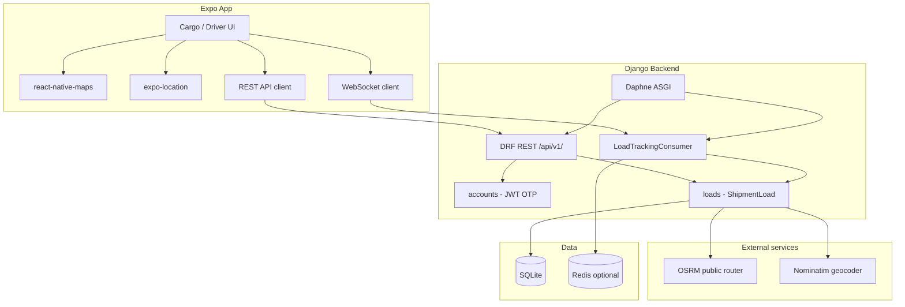

# TruckQonnect

TruckQonnect is a Zimbabwe-focused logistics platform that connects **cargo clients** (shippers) with **truck owners / drivers**. Clients post loads with exact map pickup and delivery points; drivers bid, carry goods, and stream live GPS so shippers can track shipments end to end.

## Project summary

| Layer | Stack |
|-------|--------|
| Mobile app | Expo (React Native), `expo-router`, `react-native-maps`, `expo-location` |
| API | Django 4 + Django REST Framework |
| Real-time | Django Channels (WebSockets), optional Redis |
| Database | SQLite (development) |
| Routing | OSRM (Open Source Routing Machine) over OpenStreetMap |
| Geocoding | Nominatim (address ↔ coordinates) |

### Roles

- **Cargo client** — sign up with company name, post loads (map pins + auto distance), review driver bids, track live on map.
- **Truck owner / driver** — browse nearby loads, bid, navigate with OSRM routes, broadcast GPS during active delivery.

### Core features (current)

- Email OTP registration and password reset
- JWT authentication
- Load posting with `TQ######` load IDs
- Map-based pickup/delivery selection and route distance (km)
- Live truck tracking via WebSocket + REST location updates
- OSRM multi-leg routes: truck → pickup → destination

## Repository layout

```
TruckQonnect/
├── frontend/          # Expo React Native app
├── backend/           # Django API + Channels
├── Admin/             # Admin tooling (placeholder)
└── readme.md          # This file
```

## System architecture



### Load lifecycle

1. **Create** — Cargo posts load with addresses + lat/lng (from map picker). Backend stores `ShipmentLoad`, assigns `load_id` (e.g. `TQ482910`).
2. **Route** — `GET /api/v1/loads/{load_id}/route/` calls OSRM; returns GeoJSON polyline for map display.
3. **Assign** — Driver calls `POST .../assign/` when accepting a job.
4. **Track** — Driver sends GPS via WebSocket `ws/.../tracking/{load_id}/` and `POST .../location/`. Cargo subscribes to the same channel for live marker updates.

## Getting started

### Backend

```powershell
cd backend
python -m venv .venv
.\.venv\Scripts\Activate.ps1
pip install -r requirements.txt
copy .env.example .env
python manage.py migrate
daphne -b 0.0.0.0 -p 8000 config.asgi:application
```

Optional in `.env`: `REDIS_URL=redis://127.0.0.1:6379/0` for multi-client WebSockets.

### Frontend

```powershell
cd frontend
npm install
# Physical device: point to your PC
$env:EXPO_PUBLIC_API_URL="http://<LAN-IP>:8000"
npx expo start
```

Use a **development build** or emulator for maps and location (not all features work in web-only preview).

## Key API endpoints

| Method | Path | Description |
|--------|------|-------------|
| POST | `/api/v1/auth/register/` | Register + OTP |
| POST | `/api/v1/loads/` | Create shipment load |
| GET | `/api/v1/loads/{load_id}/` | Load detail |
| GET | `/api/v1/loads/{load_id}/route/` | OSRM route + polyline |
| POST | `/api/v1/loads/{load_id}/location/` | Update truck GPS |
| POST | `/api/v1/loads/{load_id}/assign/` | Assign driver |
| WS | `/ws/tracking/{load_id}/` | Live location stream |

## Frontend components (shared UI)

| Component | Purpose |
|-----------|---------|
| `HomeAppBar` | Hello + company (left), bell + avatar (right) — cargo & driver home |
| `MapLocationPicker` | Search address + map pin for pickup/delivery (Nominatim) |
| `ShipmentCard` | Unified shipment rows (company, delivery date, route) |
| `BoxImage` | `assets/images/box.png` on client shipment cards |
| `LoadTrackingMap` | Live tracking map with OSRM polyline |

## Documentation updates

When you change architecture, env vars, or major features, update:

- This file (`readme.md`)
- `backend/.env.example` and `backend/README.md`
- `frontend/README.md`

---

_Last updated: map-based load posting, unified app bar, shipment cards, live tracking stack._
